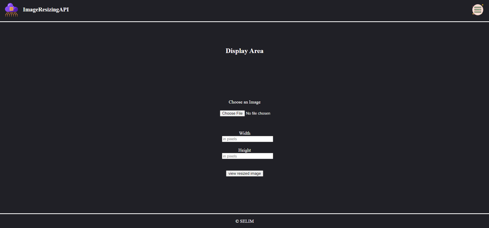
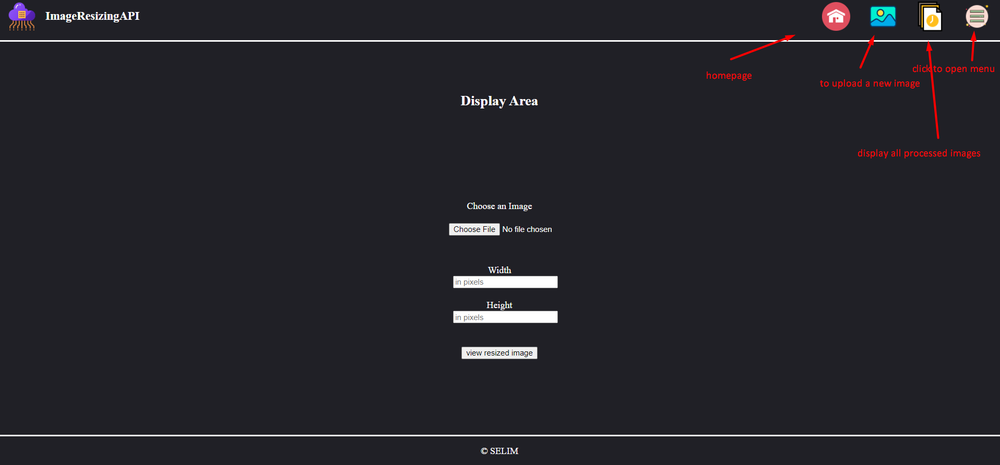

# ImageResizingAPI
<div id="top"></div>

<!--
*** Thanks for checking out the Best-README-Template. If you have a suggestion
*** that would make this better, please fork the repo and create a pull request
*** or simply open an issue with the tag "enhancement".
*** Don't forget to give the project a star!
*** Thanks again! Now go create something AMAZING! :D
-->


<!-- PROJECT SHIELDS -->
<!--
*** I'm using markdown "reference style" links for readability.
*** Reference links are enclosed in brackets [ ] instead of parentheses ( ).
*** See the bottom of this document for the declaration of the reference variables
*** for contributors-url, forks-url, etc. This is an optional, concise syntax you may use.
*** https://www.markdownguide.org/basic-syntax/#reference-style-links
-->
[![LinkedIn][linkedin-shield]][linkedin-url]


<!-- PROJECT LOGO -->
<br />
<div align="center">
  <a href="https://github.com/xValenciax/ImageResizingAPI">
    
  </a>

<h3 align="center">ImageResizingAPI</h3>

  <p align="center">
    an api that's used to resize images with jpg format 
    <br />
    <a href="https://github.com/xValenciax/ImageResizingAPI"><strong>Explore the docs »</strong></a>
    <br />
    <br />
    <a href="https://github.com/xValenciax/ImageResizingAPI">View Demo</a>
    ·
    <a href="https://github.com/xValenciax/ImageResizingAPI/issues">Report Bug</a>
    ·
    <a href="https://github.com/xValenciax/ImageResizingAPI/issues">Request Feature</a>
  </p>
</div>


<!-- TABLE OF CONTENTS -->
<details>
  <summary>Table of Contents</summary>
  <ol>
    <li>
      <a href="#about-the-project">About The Project</a>
      <ul>
        <li><a href="#built-with">Technologies used</a></li>
      </ul>
    </li>
    <li>
      <a href="#getting-started">Getting Started</a>
      <ul>
        <li><a href="#prerequisites">Prerequisites</a></li>
        <li><a href="#installation">Installation</a></li>
      </ul>
    </li>
    <li><a href="#usage">Usage</a></li>
    <li><a href="#contributing">Contributing</a></li>
    <li><a href="#contact">Contact</a></li>
    <li><a href="#acknowledgments">Acknowledgments</a></li>
  </ol>
</details>


<!-- ABOUT THE PROJECT -->
## About The Project



This is a simple fullstack project whose purpose is to apply resizing on any image to a specified size without affecting the quality of the picture

<p align="right">(<a href="#top">back to top</a>)</p>


### Built With

* [![HTML][HTML]][HTML-url]
* [![CSS3][CSS]][HTML-url]
* [![ts][Typescript]][ts-url]
* [![js][Javascript]][js-url]
* [![Node][Nodejs]][node-url]

<p align="right">(<a href="#top">back to top</a>)</p>


<!-- GETTING STARTED -->
## Getting Started

To get started you need node.js installed on your own system:

[install node]


### Installation

1. Clone the repo
   ```sh
   git clone https://github.com/xValenciax/ImageResizingAPI
   ```
2. Install required NPM packages
   ```sh
   npm install express jasmine jasmine-spec-reporter multer sharp supertest typescript ts-node nodemon
   ```
3. Run the following command to run the project in dev mode
   ```sh
    npm run dev
   ```
   or 
   ```sh
    npm run start
   ```
   to run project in production mode


<p align="right">(<a href="#top">back to top</a>)</p>


<!-- USAGE EXAMPLES -->
## Usage


this is a descriptive screeshot that shows how to interact with the home page
#### hint: images should always exist in this path `./public/assets/full` in order to be successfully accessed. you could either add them manually or upload them via the API


#### example endpoint to get to the homepage:
1. go to home page
   ```
    https://localhost:3000/public
   ```

2. test the resizing process 

   ```
    https://localhost:3000/api?image=encenadaport.jpg&width=400&height=400
   ```

_For more examples, please refer to the [Documentation](https://github.com/xValenciax/ImageResizingAPI)_

<p align="right">(<a href="#top">back to top</a>)</p>


<!-- CONTACT -->
## Contact

Your Name - [@LinkedIn profile](linkedin-url) - email@email_client.com

Project Link: [Github Repo](https://github.com/xValenciax/ImageResizingAPI)

<p align="right">(<a href="#top">back to top</a>)</p>


<!-- ACKNOWLEDGMENTS -->
## Acknowledgments

* [Digital Ocean Commnity](https://www.digitalocean.com/community/tutorials)
* [Stackoverflow](https://stackoverflow.com/)
* [Github contributions](https://github.com/)

<p align="right">(<a href="#top">back to top</a>)</p>


<!-- MARKDOWN LINKS & IMAGES -->
[linkedin-shield]: https://img.shields.io/badge/-LinkedIn-black.svg?style=for-the-badge&logo=linkedin&colorB=555
[linkedin-url]: https://www.linkedin.com/in/selim2001/
[product-screenshot]: images/screenshot.png
[HTML]: https://img.shields.io/badge/HTML-HTML5-%23dd4b25
[HTML-url]: https://www.w3schools.com/html/
[CSS]: https://img.shields.io/badge/CSS-CSS3-%2330ace0
[CSS-url]: https://www.w3schools.com/css/
[Typescript]: https://img.shields.io/badge/Typescript-TS-%233178c6
[ts-url]: https://www.typescriptlang.org/
[Javascript]: https://img.shields.io/badge/Javascript-JS-%23fcdc00
[js-url]: https://www.javascript.com/
[Nodejs]: https://img.shields.io/badge/Node-Nodejs-%23417e38
[node-url]: https://nodejs.dev/
[Nodejs]: https://img.shields.io/badge/Node-Nodejs-%23417e38
[node-url]: https://nodejs.dev/
[install node]: https://nodejs.org/en/download/